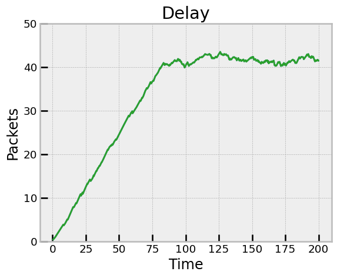

<!-- Informe sobre el laboratorio de Redes -->

# Laboratorio 3 - Capa de Transporte: 
# *Analisis, Simulacion y Protocolos de Control de Flujo y de Congestion.*
--- 

## Introducción
> En este proyecto trabajamos en la capa de transporte y simulamos el comportamiento de un modelo de cola en una red. Basados en una simulacion que consta de un Generador de Paquetes, una cola y un Consumidor de Paquetes conectados entre si, analizamos distintos casos e implementamos protocolos de control de flujo y de congestion, con el fin de realizar un analisis sobre la mejora de la red con respecto a la implementacion de estos protocolos.
---
## Indice

- **[Primera parte: Introduccion](#Primera-parte-Introduccion)**
    - [Analisis: Caso 1](#Caso-1)
        - [Analisis: Buffer's Size Caso 1](#analisis-de-los-buffers-size)
        - [Analisis: Paquetes](#analisis-de-paquetes)
        - [Analisis: Retardo de la Red](#analisis-del-retardo-de-la-red)
    - [Analisis: Caso 2](#Caso-2)
- **[Segunda parte: Introduccion](#Introduccion-Segunda-Parte)**
    - [Protocolo de Control de Flujo](#Control-de-Flujo)
    - [Protocolo de Control de Congestion](#Control-de-Congestion)
    - [Analisis: Protocolos](#Analisis-Protocolos)
        - [Analisis: Caso 1 con Protocolo](#Caso1-Protocolo)
        - [Analisis: Caso 2 con Protocolo](#Caso2-Protocolo)
- **[Conclusiones](#Conclusiones)**
- **[Metodologia de Trabajo](#Metodologia)**
- **[Referencias](#Referencias)**
- **[Video de Presentacion](#Video)**
---

## Primera parte Introduccion
En esta primera parte del laboratorio, se analizaron dos casos de estudio, en los cuales se observo el comportamiento de la red sin la implementacion de protocolos de control de flujo y de congestion. 
La red consiste en tres componentes: Un **nodo transmisor (NodeTx)**, un **buffer intermedio** y un **nodo receptor (NodeRx)**.
- El **NodeTx** genera y transmite los paquetes, actua como un host emisor, que recibe los paquetes de la capa de aplicacion y los envia a traves de la red.
> { style="display: block; margin: 0 auto" }

- El **Buffer Intermedio** es un componente que almacena los paquetes que llegan desde el NodeTx y los encola para ser enviados al NodeRx, tiene un delay en el envio de los paquetes, que le permite al NodeRx recibir y procesar los paquetes.

- El **NodeRx** recibe los paquetes y los procesa, actua como un host receptor, que recibe los paquetes de la red y es el encarga de procesarlos.

> {style="display: block; margin: 0 auto"}

De esta manera la Network queda conformada de la siguiente forma:
> {style="display: block; margin: 0 auto"}

Se analizaron los diferentes comportamientos de la red en 2 casos particulares, pero manteniendo ciertos valores en ambos casos:
- **Tamaño del Buffer de NodeTx**: 2000000.
- **Tamaño del Buffer Intermedio Queue**: 200.
- **Tamaño del Buffer de NodeRx**: 200.
- **Tamaño de los Paquetes**: 12500 Bytes.
--- 
### Caso 1
Para el caso numero 1, tenemos la siguiente configuracion de la red donde cambiamos tasas de tranmision de datos y delays en la red:

>- **Desde NodeTx a Queue**
    - **Datarate**: 1 Mbps.
    - **Delay**: 100 us.
>- **Desde Queue a NodeRx**
    - **Datarate**: 1 Mbps.
    - **Delay**: 100 us.
>- **Desde Queue a Sink**
    - **Datarate**: 0.5 Mbps.

Como podemos ver, el Out del NodeTx es de 1Mbps y el Out del queue tambien. Por lo tanto, el buffer de NodeRx será el que se saturará al tener menos capacidad en la conexion con el sink.  

En base a esta configuracion, se obtuvieron los siguientes graficos junto con sus respectivos analisis:

##### Analisis de los Buffer's Size
| GenerationInterval = 0.1 | GenerationInterval = 0.17  | GenerationInterval = 0.2  |
|--------------------------|---------------------------|---------------------------|
| |  | |
|| ||

>  En esta imagen (Intervalo de Generacion = 0.1) comparamos los tres "buffer's Size" de cada buffer, el de NodeTx, NodeRx y Queue respectivamente.
Tenemos al buffer de NodeRx que será el que se satura. Como vemos en la imagen de GenerationInterval = 0.1, llega a tener 200 paquetes constantemente, porque cada 2 paquetes que llegaban al buffer de NodeRx, este liberaría 1 al **Sink**. Gracias a esto, tenemos
**perdida de paquetes** en el buffer del NodeRx, lo cual se ve en esta imagen.
 

>  Podemos notar que al tener mayor tiempo de generacion, los buffers nunca llegan a saturarse, entonces tienen un comportamiento similar, pero con menor cantidad de paquetes almacenados. Incluso en 0.2 de intervalo, podemos notar que el buffer de NodeTx llega a tener 0 paquetes almacenados, ya que al igual que el buffer de Queue, le da tiempo de recibir y liberar los paquetes antes de que llegue otro.
Como vemos el nodo Rx es el que va aumentando su buffer size, ya que recibe con una velocidad de 1Mbps y libera con una velocidad de 0.5Mbps, entonces se va llenando a medida que pasa el tiempo.
 

Grafico zoomeado 0.1:
>  Por lo que hablabamos anteriormente, el buffer size de Queue es siempre 1, ya que recibe con una velocidad de 1Mbps y libera con la misma velocidad, entonces no hay razon para que se sature.
En cuanto al buffer de NodeTx, este llega a almacenar hasta 32 paquetes, pero esto esta relacionado a que el **GenerationTime** de el Generador podia ser mayor al **tiempo de liberacion** del NodeTx, entonces por esto tenia que almacenar algunos paquetes, pero es una practica que no generó ningun problema ni "packets drop". 
 

---
##### Analisis de Paquetes
Aclaracion sobre el grafico: En este grafico decidimos el eje Y ilustrarlo de otra forma, como un acumulador. Entonces cuando vemos el grafico, vemos (en el caso de Packets Generated) la cantidad de paquetes generados hasta el segundo que veamos en el eje x. De esta forma pensamos que podiamos interpretar mejor los datos, ya que sino en los packets Drop teniamos una linea constante en 1, de esta nueva forma podemos ver cuantos paquetes se dropean.

| GenerationInterval = 0.1 | GenerationInterval = 0.17  | GenerationInterval = 0.2  |
|--------------------------|---------------------------|---------------------------|
| |  | |

> En esta imagen (Generation interval = 0.1) vemos que no tenemos paquetes perdidos en el Nodo Tx ni tampoco en Queue e incluimos tres variables mas que nos sirven para analizar el comportamiento; Packets Generated, Packets Used y Packet Drop in NodeRx respectivamente. 
Packets Generated es incluido en el Generator, cada vez que creamos un nuevo paquete aumentamos este vector. 
Packets Used es incluido en el Sink y cada vez que llega un paquete lo aumentamos. 
Entonces podemos observar que en 200 segundos tenemos aproximadamente **2000 paquetes generados** y aproximadamente **1000 paquetes usados**. Este comportamiento se da gracias a lo que hablabamos antes, cada 2 paquetes que llegan al **Queue del Nodo Rx**, el liberaba 1. 
Luego tenemos alrededor de 750 Packets Drops en el NodeRx y si vemos el grafico anterior de los ["Buffer's Size"](#analisis-de-los-buffers-size), el buffer del **Nodo Rx** termina con 200 paquetes, luego si sumamos todo esto, tenemos aproximadamente 2000 paquetes dropeados. 
Otra cosa que podemos observar a partir de estos graficos para revisar que el comportamientoo esta bien, es que los Packets Drops en el NodeRx empiezan a hacerse una vez que se llena su [buffer size](#analisis-de-los-buffers-size), entonces como los tiempos coinciden, notamos que esta funcionando correctamente.
 

> Cuando el intervalo de generacion es mayor, le da tiempo al NodeRx a procesar los paquetes, por lo que no se saturan los buffers y no se pierden paquetes. Entonces a medida de que el intervalo crece, podemos ver que los Paquetes usados y generados se van acercando, ya que el NodeRx tiene tiempo de procesar los paquetes que llegan y se usan los mismos que se generan.

---
##### Analisis del Retardo de la Red

| GenerationInterval = 0.1 | GenerationInterval = 0.17  | GenerationInterval = 0.2  |
|--------------------------|---------------------------|---------------------------|
| |  | |

Caso IntervalGen = 0.1:
> Como al principio no tenemos ningun inconveniente, podemos notar que se entregan los paquetes sin percances. 
A medida que pasa el tiempo el **buffer del Nodo Rx** se llena y tenemos problemas de congestion y flujo, luego a raiz de esto los paquetes tardan mas en ser entregados o algunos ni siquiera son entregados.
Es importante tener en cuenta que el Delay se calcula como el tiempo desde que se genera el paquete hasta que es entregado a Sink.
 

>  Podemos notar que mientras mayor sea el intervalo de generacion, menor es el delay, esto se debe a que el delay es la demora entre que un paquete se genera y llega al sink, entonces al generar menos y por ende no almacenarse tanto en los buffers, los paquetes pasan mas rapido en la red llegando al sink mas rapido y disminuyendo asi el delay.
 

---
### Caso 2
Para el caso numero 2, tenemos la siguiente configuracion de la red:

>- **Desde NodeTx a Queue**
    - **Datarate**: 1 Mbps.
    - **Delay**: 100 us.
>- **Desde Queue a NodeRx**
    - **Datarate**: 0.5 Mbps.
    - **Delay**: 100 us.
>- **Desde Queue a Sink**
    - **Datarate**: 1 Mbps.

En este caso el buffer que se saturará es de Queue, ya que recibe con una velocidad de 1Mbps y transmite a una velocidad de 0.5 Mbps. Los resultados deberian ser muy parecidos al anterior caso, pero ahora con los packet drop en el queue.

En base a esta configuracion, se obtuvieron los siguientes graficos:

##### Analisis de los Buffer's Size en Caso 2
| GenerationInterval = 0.1 | GenerationInterval = 0.17  | GenerationInterval = 0.2  |
|--------------------------|---------------------------|---------------------------|
|  |  | |
|| ||

Caso GenerationInterval = 0.1 :
> La diferencia con el caso uno es que hora el NodeTx sigue igual, pero el Queue se satura y el NodeRx se mantiene constante en 1, porque recibe con una velocidad de 1Mbps y transmite con la misma a su sink. 
 

> Comportamiento similar al caso 1, pero ahora el buffer de Queue es el que va creciendo, y ahora es el buffer de NodeRx el que se mantiene constante en 1, ya que recibe con una velocidad de 1Mbps y transmite con la misma a su sink.
 

##### Analisis de Paquetes en Caso 2

| GenerationInterval = 0.1 | GenerationInterval = 0.17  | GenerationInterval = 0.2  |
|--------------------------|---------------------------|---------------------------|
| |  | |

Caso GenerationInterval = 0.1 :
> Ahora los **packet Drop** ocurren en la Queue y tanto los packets drop del NodeRx como los de NodeTx se mantienen en 0. Los calculos hechos anteriormente sobre los packets drop tambien sirven para este grafico.
Tambien cabe aclarar que tanto los Paquetes Generados como los Paquetes usados se mantienen iguales en ambos casos de estudio.
 

> Comportamiento practicamente identico al caso 1 con los respectivos intervalos de generacion.
 

##### Analisis del Retardo de la Red en Caso 2

| GenerationInterval = 0.1 | GenerationInterval = 0.17  | GenerationInterval = 0.2  |
|--------------------------|---------------------------|---------------------------|
|  |  | |

Caso GenerationInterval = 0.1 :
> Como el delay lo medimos en base a el **Sink**, cuando llegan los paquetes, los problemas de congestion/flujo siguen existiendo, en otro lugar, pero siguen estando, entonces el delay es casi el mismo en ambos casos de estudio. 
 

>  Al igual que en el caso 1 con los demas intervalos de generacion, el delay es practicamente el mismo al no tener packets drops.
 

---

## Introduccion Segunda Parte
En esta segunda parte del laboratorio, se implementaron protocolos de control de flujo y de congestion, con el fin de mejorar el rendimiento de la red y analizar los resultados obtenidos.

A continuacion se va a explicar brevemente en que consisten estos protocolos y como se implementaron en el codigo.

#### Idea general de nuestro algoritmo
La idea general de nuestro algoritmo es implementar tanto la solucion para el control de flujo como para el control de congestion al mismo tiempo.
Para esto lo que buscamos hacer es establecer un canal de comunicacion entre el nodo emisor, la buffer Queue y el nodo receptor, donde el receptor le indica al emisor si cuenta con suficiente espacio en el buffer para almacenar mas paquetes, en el caso del Buffer Queue, este le envia su mensaje al nodeR y este le envia su mensaje al nodeTx.
Pueden ser 2 tipos de mensajes, uno para aumentar la tasa de transmision de paquetes y otro para disminuir la tasa de transmision de paquetes.

Entonces, la network queda consolidada de la siguiente manera:
> {style="display: block; margin: 0 auto"}

A continuacion vamos a explicar como implementamos estos protocolos en el codigo.

--- 
### Control de Flujo
> El control de flujo es un mecanismo que permite regular la cantidad de datos que se envian a traves de la red, con el fin de evitar la saturacion de la red y la perdida de paquetes. 
En particular, nosotros implementamos el protocolo de control de flujo que consiste en establecer un canal de comunicacion entre el emisor y el receptor, donde el receptor le indica al emisor si cuenta con suficiente espacio en el buffer para almacenar mas paquetes. 
De esta forma, si el buffer del receptor esta cerca de llenarse, el receptor le indica al emisor que debe disminuir la tasa de transmision de paquetes evitando asi la saturacion de la red.

##### Como implementamos esto?
Para esto modificamos el codigo del archivo TransportTx.cc de la siguiente forma:

Lo que hacemos aca es que el emisor recibe un mensaje del receptor, dependiendo de que tipo de mensaje sea, el emisor disminuye o aumenta el packetRate, en funcion de esta Variable en la linea 12 de scheduleAt va a modificar el tiempo de encolamiento del endServiceEvent, entonces si el packetRate es mayor, el tiempo en el que se encola el endServiceEvent va a ser mayor, y si el packetRate es menor, el tiempo en el que se encola el endServiceEvent va a ser menor.
De esta manera se controla la tasa de transmision de paquetes, desde el nodeTx.

### Control de Congestion
Lo que hacemos en esta parte es implementar un protocolo de control de congestion, que consiste en crear un umbral de congestion, que se activa cuando el buffer de la red esta cerca de llenarse.
Cuando pasa esto, el receptor le envia un mensaje al emisor para que disminuya la tasa de transmision de paquetes, evitando asi la saturacion de la red y la perdida de paquetes.
Si no se supera el umbral de congestion, el receptor envia un mensaje al emisor para que aumente la tasa de transmision de paquetes.

##### Como implementamos esto?
Para esto modificamos el codigo del archivo TransportTx.cc de la siguiente forma:

Y el codigo del archivo Queue.cc de la siguiente forma:

El codigo es practicamente igual en ambos, lo que hacemos es crear tanto un umbral minimo como un umbral maximo, si el buffer del nodo esta por debajo del umbral minimo, el receptor le envia un mensaje al emisor para que aumente la tasa de transmision de paquetes, y si el buffer del nodo esta por encima del umbral maximo, el receptor le envia un mensaje al emisor para que disminuya la tasa de transmision de paquetes.

Tanto en el buffer Queue como el NodeRx, se implementa casi el mismo codigo, con la diferencia de que como el nodeRx puede recibir mensajes de la Queue o Crearlos, entonces tenemos un bloque condicional al inicio del protocolo que se encarga de enviar el mensaje al nodeTx.

--- 

### Analisis Protocolos
En base a la implementacion de estos protocolos, se analizaron los resultados obtenidos en los casos 1 y 2, con el fin de comparar los resultados obtenidos con y sin la implementacion de estos protocolos.

#### Caso 1 con Protocolo
Misma configuracion que en el caso 1, pero ahora con la implementacion de los protocolos de control de flujo y de congestion.
##### Analisis de los Buffer's Size en Caso 1 con Protocolo
| GenerationInterval = 0.1 | GenerationInterval = 0.17  | GenerationInterval = 0.2  |
|--------------------------|---------------------------|---------------------------|
| |  | |
|| ||

> Podemos ver que hay ciertos cambios en este grafico en comparacion con el caso 1 sin protocolo.
Lo primero que podemos observar es que el Buffer Size de la Queue se mantiene constante en 1 por lo explicado anteriormente en [caso 1](#analisis-de-los-buffers-size).
Luego podemos ver que el Buffer Size de NodeTx crece con un ritmo acelerado, esto se debe a que cuando se supera el umbral del buffer size de NodeRx, el NodeTx debe disminuir su tasa de transmision de paquetes, pero estos paquetes se quedan almaacenados en el Buffer de NodeTx, esto hace que el buffer de NodeTx crezca con el tiempo, y al ser "ilimitado" no genere problemas por este lado.
 

---- 

En las imagenes de la segunda fila podemos ver de mas cerca el Buffer Size de NodeRx:

>  Aca podemos ver que el buffer size de NodeRx crece exponencialmente y se capea en 160, esto se debe a que es el valor que nosotros establecimos como **umbral maximo**, entonces a partir de este punto se empiezan a mandar paquetes al mismo ritmo que los va a recibiendo, lo que hace que su size se mantenga constante. Cabe aclarar que el valor del umbral es arbitrario y puede ser modificado, quiza optimizando el rendimiento de la red mediante una configuracion distinta de este valor, elegimos estos valores luego de experimentar algunos y determinar que era un valor aceptable para el rendimiento, mas no el optimo.
Tambien podemos ver de mas cerca el Buffer Size de Queue
 

---

##### Analisis de Paquetes en Caso 1 con Protocolo
| GenerationInterval = 0.1 | GenerationInterval = 0.17  | GenerationInterval = 0.2  |
|--------------------------|---------------------------|---------------------------|
|  |  | |

> Bueno como podemos ver en este grafico, gracias a nuestro protocolo, ahora no tenemos ningun **Packet Drop** en ningun buffer.
Luego podemos observar que tenemos la misma cantidad de Paquetes Generados y tambien podemos ver tenemos el mismo valor de Paquetes Usados, que en el caso **sin protocolo**.
 

>  En el resto de casos de los intervalos de generacion, podemos ver que el comportamiento es muy similar al caso 1 sin el protocolo, los picos entre 0 y 1 en el Buffer Queue se deben a que recolectamos los datos de una manera diferente, justamente para expresar estos picos donde tenemos 0 paquetes.

---

##### Analisis del Retardo de la Red en Caso 1 con Protocolo
Es importante aclarar que el **eje X** de este grafico son los segundos en el **tiempo de simulacion**, y el **eje Y** es el delay por paquetes en segundos.

| GenerationInterval = 0.1 | GenerationInterval = 0.17  | GenerationInterval = 0.2  |
|--------------------------|---------------------------|---------------------------|
| |  | |

>  Aca poodemos ver el problema de nuestro protocolo, el cual es que si bien nuestro Algoritmo corrige el hecho de que se pierden los paquetes, esto lo pagamos con que se aumenta el delay entre paquetes.
Entonces podemos ver que al inicio los paquetes tienen menor delay pero en funcion de que va pasando el tiempo el delay crece, esto se debe a que como el NodeTx disminuye la transmision de paquetes, se quedan almacenados en su buffer y debe esperar a que NodeRx procese estos paquetes y los envie al Sink.
 

---
#### Caso 2 con Protocolo
Misma configuracion que en el caso 2, pero ahora con la implementacion de los protocolos de control de flujo y de congestion.

##### Analisis de los Buffer's Size en Caso 2 con Protocolo

| GenerationInterval = 0.1 | GenerationInterval = 0.17  | GenerationInterval = 0.2  |
|--------------------------|---------------------------|---------------------------|
| |  | |
|| ||

> Podemos observar que el comportamiento de los **Buffer's Size** entre los distintos casos de estudio **con el protocolo** es practicamente **identico**.
 

---

##### Analisis de Paquetes en Caso 2 con Protocolo

| GenerationInterval = 0.1 | GenerationInterval = 0.17  | GenerationInterval = 0.2  |
|--------------------------|---------------------------|---------------------------|
| |  | |

> Es practicamente igual el comportamiento de los paquetes entre el caso 1 y el caso 2 con el protocolo
 

---

##### Analisis del Retardo de la Red en Caso 2 con Protocolo

| GenerationInterval = 0.1 | GenerationInterval = 0.17  | GenerationInterval = 0.2  |
|--------------------------|---------------------------|---------------------------|
| |  | |

>  Como vemos el comportamiento entre caso 1 y 2 con protocolo es identico.
 

---
Podemos ver que con protocolo o sin el comportamiento cuando el intervalo de generacion crece, es practicamente el mismo.

## Conclusiones

Bueno como conclusion, podemos observar que comparando la parte 1 con la parte 2, el algoritmo que desarrollamos soluciona el hecho de los **Packets Drops**, pero lo paga con un aumento en el **delay** de los paquetes, lo cual seria algo a resolver en un futuro para una mejora en nuestro algoritmo.
Tambien es importante aclarar que pueden existir configuraciones mas optimas para nuestro protocolo, quiza establenciendo otro tipo de **umbral** o modificando el tiempo de encolamiento de los paquetes usando otra formula para el **packetRate**, es algo que si bien experimentamos, no fuimos exhaustivos en la busqueda de la mejor configuracion, habiendo quiza una posibilidad de mejorar la eficiencia.

#### Metodologia de trabajo
Para la realizacion de este laboratorio, utilizamos la metodologia de Dividirnos las tareas entre los integrantes, y trabajar siempre de a 2 utilizando la tecnica de Pair Programming, comunicandonos a traves de Discord y compartiendo pantalla para poder trabajar en conjunto.
Para realizar un seguimiento de los cambios, utilizamos Notion para documentar cada correcion o cambio.

#### Herramientas utilizadas
- Omnet++: Para la simulacion de la red.
- C++: Para la implementacion de los protocolos.
- Jupyter Notebook: Para la realizacion de los graficos.
    - Matplotlib: Para la realizacion de los graficos.
    - Pandas: Para la manipulacion de los datos.
    - Numpy: Para la manipulacion de los datos.
- Notion: Para documentar los cambios y correcciones.
- Discord: Para comunicarnos y trabajar en conjunto.
- BitBucket: Para el control de versiones.

---
## Referencias
- [Videos y Filminas de la Catedra](https://www.famaf.unc.edu.ar/)
- [Manual de Omnet++](https://www.omnetpp.org/documentation)
- [Libro de Tenebaumm](https://www.amazon.com/Computer-Networks-5th-Andrew-Tanenbaum/dp/0132126958)

## Video
Link al video de la presentacion: [Video](https://drive.google.com/file/d/1YphAnJPEaVbttheoTxIoH9i_UTXfBnRD/view?usp=sharing)
